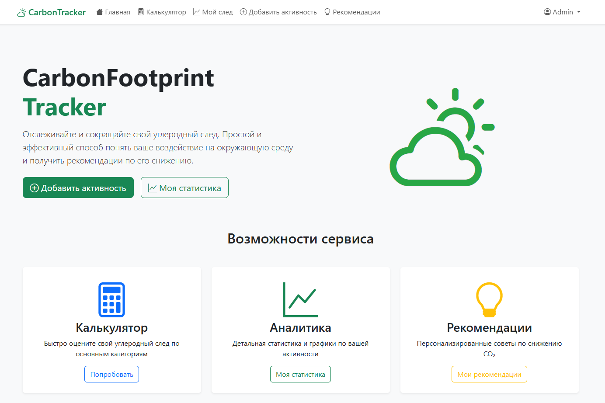
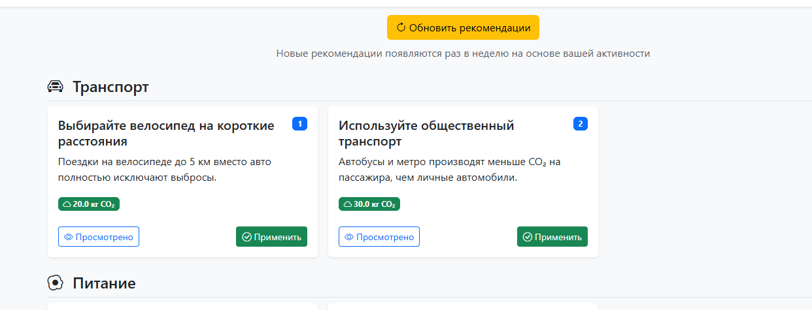
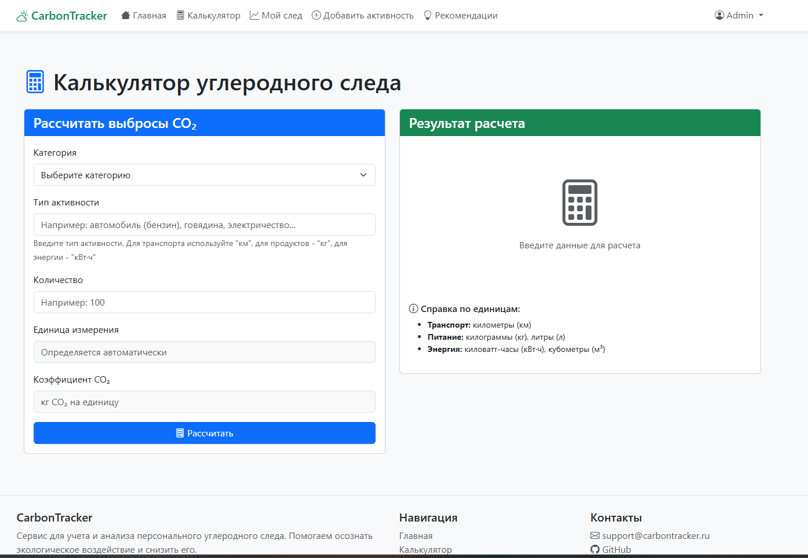

# CarbonFootprint Tracker 🌱

Веб-сервис для учёта, анализа и снижения персонального углеродного следа. Помогает пользователям осознать экологическое воздействие своих повседневных привычек (транспорт, питание, энергопотребление) через автоматические расчёты выбросов CO₂, визуализацию данных и получение персонализированных рекомендаций по переходу к экологичному образу жизни.

**Ссылка на рабочий проект:** *будет добавлена после деплоя на PythonAnywhere*

## Технологии
* **Python 3.12** - основной язык программирования
* **Django 4.2** - веб-фреймворк для бэкенда
* **Pandas** - анализ и агрегация данных
* **Plotly** - создание интерактивных графиков
* **Bootstrap 5** - CSS-фреймворк для адаптивного дизайна
* **SQLite** - база данных для разработки
* **Django REST Framework** - REST API (в разработке)

## Скриншоты

### 1. Главная страница

*Главная страница с навигацией, быстрой статистикой и общими рекомендациями*

### 2. Рекомендации по снижению CO₂

*Система персонализированных рекомендаций с фильтрацией по категориям*

### 3. Административная панель


## Как запустить проект локально

### 1. Клонируйте репозиторий:
```bash
git clone https://github.com/soniam4/carbonfootprint-tracker.git
cd carbonfootprint-tracker

2. Создайте и активируйте виртуальное окружение:
bash
# Для Windows:
python -m venv venv
venv\Scripts\activate

# Для Linux/Mac:
python3 -m venv venv
source venv/bin/activate

3. Установите зависимости:
pip install -r requirements.txt

4. Выполните миграции базы данных:
bash
python manage.py makemigrations
python manage.py migrate

5. Запустите сервер разработки:
bash
python manage.py runserver

6. Откройте проект в браузере:
Главная страница: http://127.0.0.1:8000/
Административная панель: http://127.0.0.1:8000/admin/